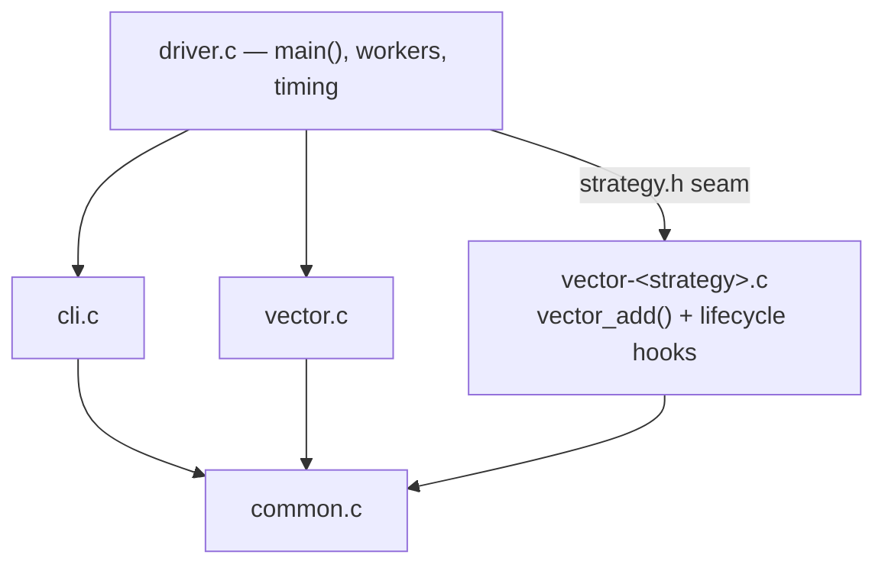

# OS Concurrency & Deadlock Analysis

Five multithreaded implementations of the same `vector_add()` routine, each
using a different locking strategy, built to explore **deadlock, its causes,
and the classic ways to prevent it** — the OSTEP *Common Concurrency Problems*
homework, engineered as a real project.

The five programs share a single substrate and differ **only** in how
`vector_add()` acquires its locks:

| Binary | Strategy | Coffman condition removed | Deadlock-free? | Correct? |
|---|---|---|---|---|
| `vector-deadlock` | fixed-order locking (baseline) | none | ✗ | ✓ when it completes |
| `vector-global-order` | total lock ordering by id | circular wait | ✓ | ✓ |
| `vector-try-wait` | trylock + randomized backoff | hold-and-wait | ✓ | ✓ |
| `vector-avoid-hold-and-wait` | one global acquisition lock | hold-and-wait | ✓ | ✓ |
| `vector-nolock` | no locks (intentionally racy) | mutual exclusion | ✓ | ✗ (loses updates) |

> **Origin & honesty.** The repository had no starter source when work began;
> all C here is a **reconstruction** from the homework description, documented
> as such in [docs/architecture.md](docs/architecture.md). Every result quoted
> in the docs (timings, retry counts, sanitizer output) is a **real run** on
> the development host — nothing is fabricated.

## Quick start

```bash
make            # build all five binaries into bin/ (strict -Werror)
make test       # run the 34-assertion functional suite
make benchmarks # sweep timings into benchmark-results/
```

```bash
# See two threads deadlock (will hang — Ctrl-C it):
./bin/vector-deadlock -n 2 -l 100000 -d

# The same workload, deadlock-free:
./bin/vector-global-order -n 2 -l 100000 -d --check
```

## Architecture in one picture

Each binary is one strategy object linked against the shared substrate; the
driver is strategy-agnostic and talks to it through `strategy.h`.



Full design rationale: **[docs/architecture.md](docs/architecture.md)**.

## Build

Requirements: a C11 compiler (clang or gcc) with pthreads. Tested with Apple
clang 21 on arm64 macOS; the CI builds and sanitizes on Ubuntu.

| Command | Result |
|---|---|
| `make` | all five binaries → `bin/` (`-O2 -g`, `-Wall -Wextra -Wpedantic -Werror`) |
| `make debug` | unoptimised build → `bin/debug/` |
| `make asan` | AddressSanitizer + UBSan → `bin/asan/` |
| `make tsan` | ThreadSanitizer → `bin/tsan/` |
| `make ubsan` | UndefinedBehaviorSanitizer → `bin/ubsan/` |
| `make test` | build + functional suite |
| `make benchmarks` | build + timing sweep |
| `make clean` | remove build artifacts |

## Usage / CLI

All five binaries accept the same options:

```
-n <num>     worker threads            (default 2, > 0)
-l <num>     vector_add calls / worker (default 1, > 0)
-v           verbose: print vectors before and after
-d           deadlock ordering: odd threads lock in reverse order
-p           parallel: each worker owns a disjoint vector pair
-t           print elapsed wall-clock time
--length <n> elements per vector       (default 100, > 0)
--check      verify the deterministic result and set the exit code
-h, --help   show help and exit
```

Invalid input (missing value, `0`, negative, non-numeric, overflow, unknown
flag) is rejected with a specific message and exit code 2.

## Testing

`make test` runs [tests/run-tests.sh](tests/run-tests.sh): CLI validation,
single/multi-threaded correctness (`--check`), the parallel and
safe-under-`-d` configurations, a **bounded** deadlock demonstration, and the
`nolock` lost-update demonstration. Nondeterministic phenomena are retried, not
weakened. Latest: **34 passed, 0 failed**. Details:
**[docs/testing-strategy.md](docs/testing-strategy.md)**.

## Sanitizers

- **TSan** reproduces the `nolock` data race and reports **0 races** for the
  three safe strategies (and for `nolock -p`, confirming the race is about
  *sharing*).
- **UBSan** caught a real signed-overflow bug (fixed in its own commit); now
  clean.
- **ASan** shows no leaks — every mutex is destroyed, every allocation freed.

Real output and commands: **[docs/testing-strategy.md](docs/testing-strategy.md)**.

## Benchmarks

Measured on an 8-core Apple M1 Pro (mean of 3 runs, `loops=100000`):

- Shared-vector work does **not** scale — more threads add contention, not
  throughput.
- `avoid-hold-and-wait` is ~5.6× slower than `global-order` under parallel load
  because its global lock serializes even disjoint work.
- `nolock` scales best in parallel (and is only correct there).

Numbers and interpretation: **[docs/benchmark-analysis.md](docs/benchmark-analysis.md)**
· raw data: [benchmark-results/](benchmark-results/).

## Documentation map

| Doc | Contents |
|---|---|
| [architecture.md](docs/architecture.md) | layout, module design, strategy seam, ownership, thread model |
| [concurrency-strategies.md](docs/concurrency-strategies.md) | per-strategy deep dive, Coffman conditions, diagrams, interview Qs |
| [testing-strategy.md](docs/testing-strategy.md) | test matrix, sanitizer output, timeout design |
| [benchmark-analysis.md](docs/benchmark-analysis.md) | measured performance analysis |
| [assignment-answers.md](docs/assignment-answers.md) | the 10 homework questions, answered with real runs |
| [ai-usage.md](docs/ai-usage.md) | AI assistance disclosure and validation |

## Limitations

- **Deadlock and lost-update tests are probabilistic.** They are retried and the
  suite fails if the phenomenon never appears, but they are demonstrations, not
  proofs.
- **Absolute benchmark numbers are host-specific** (8-core M1 Pro, Apple clang
  21). Only the *relative* ordering of strategies is portable; re-run
  `make benchmarks` elsewhere.
- **Modular arithmetic.** Vector elements are `unsigned` and wrap by design so
  the `-d` stress path has no undefined behaviour; the values are a vehicle for
  studying locking, not a numeric result of interest.
- **`nolock` is intentionally incorrect** on shared data and is included only to
  quantify the speed-vs-correctness trade-off.

## Lessons learned

1. **Deadlock hides under light load.** `-l 1` almost never deadlocks; `-l 1e5`
   almost always does. Testing must stress the timing windows.
2. **The cheapest correct fix is a global lock order** — deadlock-free by
   construction, and the fastest of the correct strategies.
3. **"Deadlock-free" is not "fast."** The global acquisition lock is safe yet
   serializes work that should be parallel.
4. **Sanitizers earn their keep.** TSan turns an invisible race into a concrete
   stack trace; UBSan found a real overflow that all functional tests missed.
5. **Correctness first.** `nolock` is the fastest option and completely useless
   on shared data.

## Topics

Deadlocks · Mutexes · POSIX Threads · Concurrency · Synchronization ·
Operating Systems · Performance Analysis · C
