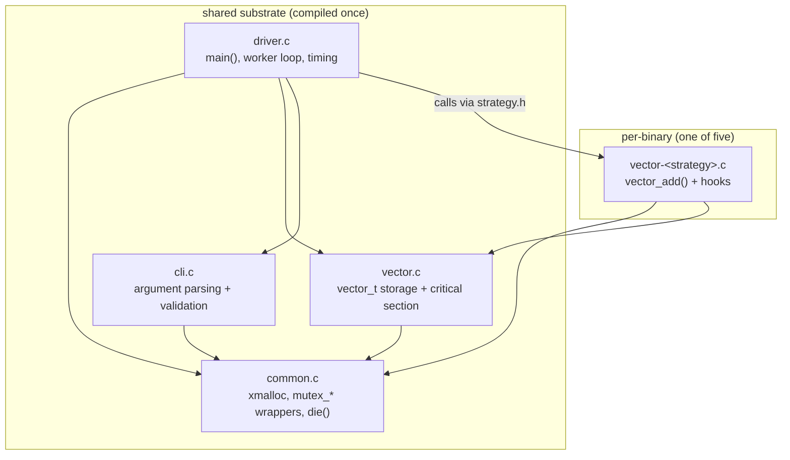
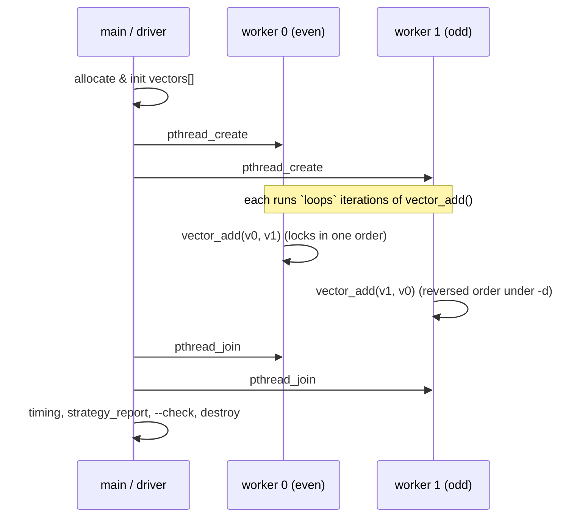

# Architecture

## 1. Goal and shape of the solution

The OSTEP *Common Concurrency Problems* homework ships five near-identical C
programs that each implement a multithreaded `vector_add()` a different way.
Written naively, those five files are ~90% copy/paste, and every fix to the
shared scaffolding has to be applied five times. That is exactly the kind of
duplication that rots.

This repository instead factors the common substrate into one place and lets
each strategy be **only the code that actually differs** — the locking
discipline inside `vector_add()`. Everything else (argument parsing, vector
storage, worker orchestration, timing, verification, cleanup) is shared and
compiled once.

> **Provenance.** No starter files were present in the repository when work
> began (only `README.md`, `.gitignore`, and an empty `LICENSE`). All source
> here is **reconstructed** from the homework description in
> `CommonConcurrencyProblems.pdf`; it is not the original OSTEP `main-common.c`
> et al. The reconstruction deliberately preserves the homework's command-line
> interface and semantics so the questions can be answered against it. The
> mapping to the homework's file names is in §4.

## 2. Repository layout

```
os-concurrency/
├── include/            # public headers (the module interfaces)
│   ├── common.h        #   fail-fast alloc + pthread wrappers, exit codes
│   ├── vector.h        #   the shared vector data structure
│   ├── cli.h           #   config_t + argument parsing
│   ├── strategy.h      #   the seam every strategy implements
│   └── driver.h        #   the shared program body
├── src/
│   ├── common.c        # ┐
│   ├── vector.c        # ├ shared substrate (compiled once, linked into all)
│   ├── cli.c           # │
│   ├── driver.c        # ┘ contains main() and the worker loop
│   ├── vector-deadlock.c            # ┐
│   ├── vector-global-order.c        # │
│   ├── vector-try-wait.c            # ├ one file per strategy: just vector_add
│   ├── vector-avoid-hold-and-wait.c # │  + four small lifecycle hooks
│   └── vector-nolock.c              # ┘
├── tests/run-tests.sh          # functional suite (bounded by timeouts)
├── scripts/run-benchmarks.sh   # timing sweep -> benchmark-results/
├── benchmark-results/          # real CSV + summary (committed)
├── docs/                       # this documentation set
├── .github/workflows/ci.yml    # build + test + sanitizers in CI
└── Makefile
```

## 3. Module design and dependencies

Each strategy binary is built from **one strategy object + the four shared
objects**. The dependency arrows all point inward toward the leaf modules; no
shared module depends on a strategy.



**The strategy seam (`strategy.h`)** is the whole trick. `driver.c` never names
a concrete strategy; it calls four functions it expects the linked object to
provide:

| Symbol | Purpose |
|---|---|
| `const char *strategy_name(void)` | label for verbose/timing output |
| `void strategy_init(void)` | one-time setup (e.g. global acquisition mutex) |
| `void vector_add(vector_t*, vector_t*)` | **the locking discipline under study** |
| `void strategy_report(FILE*)` | strategy stats (e.g. trylock retries) |
| `void strategy_cleanup(void)` | tear down whatever `strategy_init` built |

Linking a different `vector-*.o` produces a different binary with different
concurrency behaviour and zero changes to the surrounding code. This is
plain-C dependency injection at link time.

## 4. Mapping to the OSTEP homework file names

| Homework file | Role here |
|---|---|
| `main-common.c` | `src/driver.c` (worker loop, timing, orchestration) |
| `main-common.h` / `main-header.h` | `include/driver.h` + `include/cli.h` |
| `vector-header.h` | `include/vector.h` |
| `vector-deadlock.c` … `vector-nolock.c` | same names under `src/` |

The split into `driver.h`/`cli.h` and a dedicated `common`/`strategy` layer is
the one intentional structural improvement over the homework's flat layout; it
is what makes the "shared code, not duplicated code" property enforceable.

## 5. Ownership and lifetime

- A `vector_t` **owns** its `values` heap buffer and its `pthread_mutex_t`.
  `vector_init()` establishes both; `vector_destroy()` releases both, exactly
  once. Every initialised mutex is destroyed — verified leak-free under ASan.
- `vector_t` is **never copied by value**. Copying would duplicate a
  `pthread_mutex_t`, which is undefined behaviour, so vectors are always passed
  by pointer. This is a documented invariant in `vector.h`.
- The driver owns the `vectors[]`, `threads[]`, and `args[]` arrays and frees
  them after every worker has joined.
- Strategy-global state (the try-wait retry counter, the avoid-hold-and-wait
  acquisition mutex) is owned by its strategy file and managed through
  `strategy_init`/`strategy_cleanup`.

## 6. Thread model



The **worker index mapping** is what makes the deadlock reproducible and is
therefore documented precisely in `driver.c`:

- **shared mode (default):** every worker operates on `vectors[0]` and
  `vectors[1]`. With `-d`, odd-numbered workers swap the pair so even/odd
  workers request the two locks in opposite orders — the circular wait.
- **parallel mode (`-p`):** worker *t* gets the disjoint pair `(2t, 2t+1)`, so
  no two workers ever touch the same vector. No contention, no deadlock, and
  even the lock-free strategy is correct.

## 7. Error-handling philosophy

The pthread and allocation calls in this program fail only on *programmer*
errors (an uninitialised mutex) or resource exhaustion (OOM) — never on
recoverable runtime conditions. So `common.c` wraps them to **fail fast and
loud**: print a specific message and exit with a distinct code
(`EXIT_ALLOC`, `EXIT_PTHREAD`, …). This keeps the strategy code readable (no
`if (rc) { … }` noise around every lock) while never silently swallowing a
failure. `mutex_trylock()` is the one wrapper that returns — it distinguishes
`0` (acquired) from `EBUSY` (contended) and still aborts on any *other* error.

See `docs/concurrency-strategies.md` for the per-strategy analysis and
`docs/testing-strategy.md` for how each claim above is verified.
