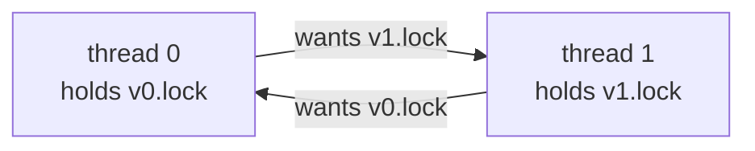
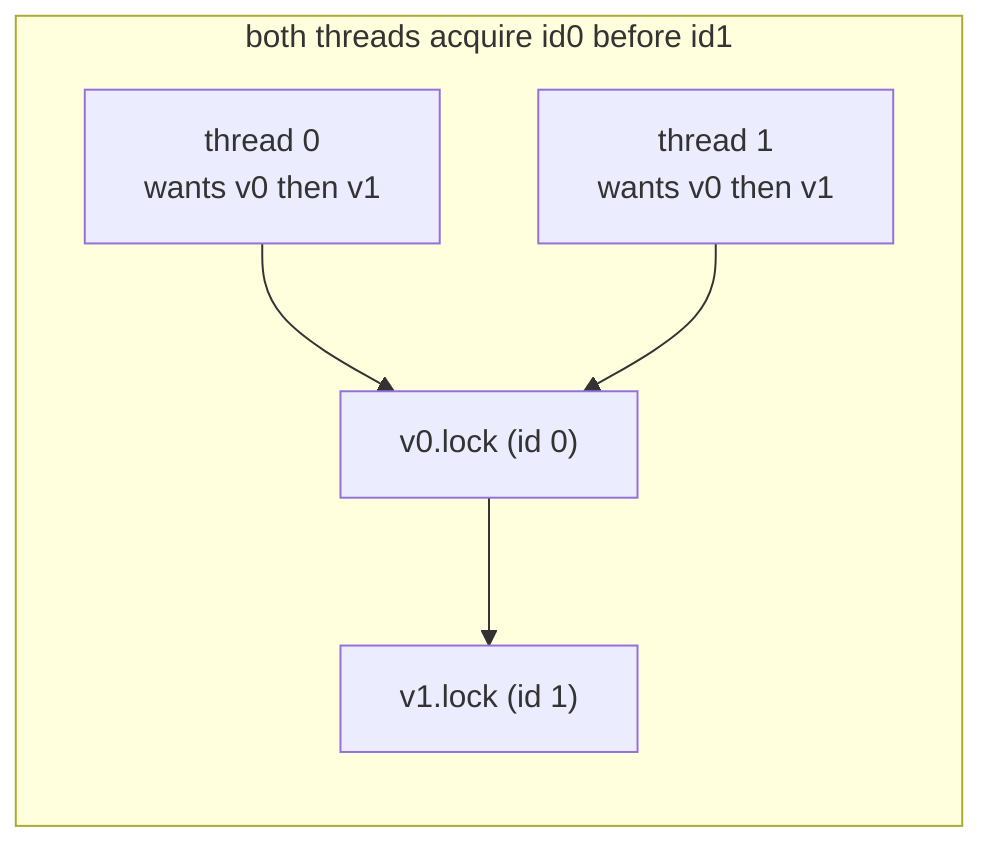
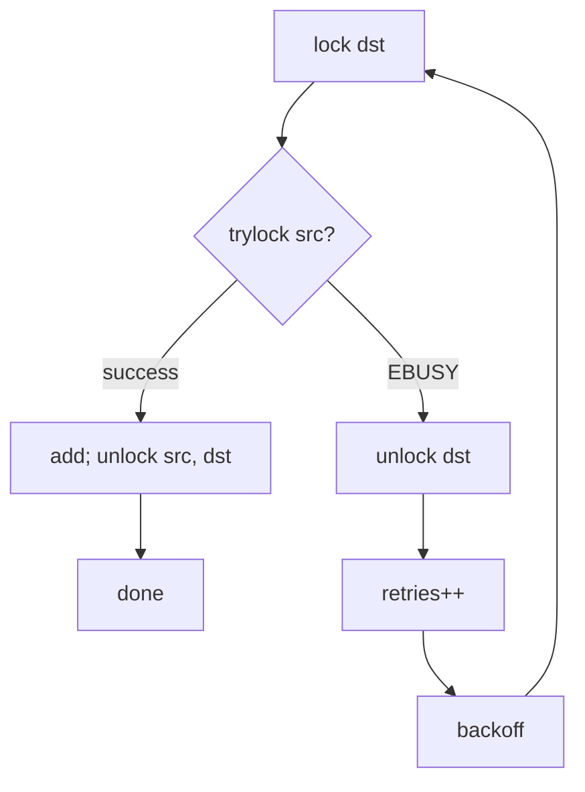
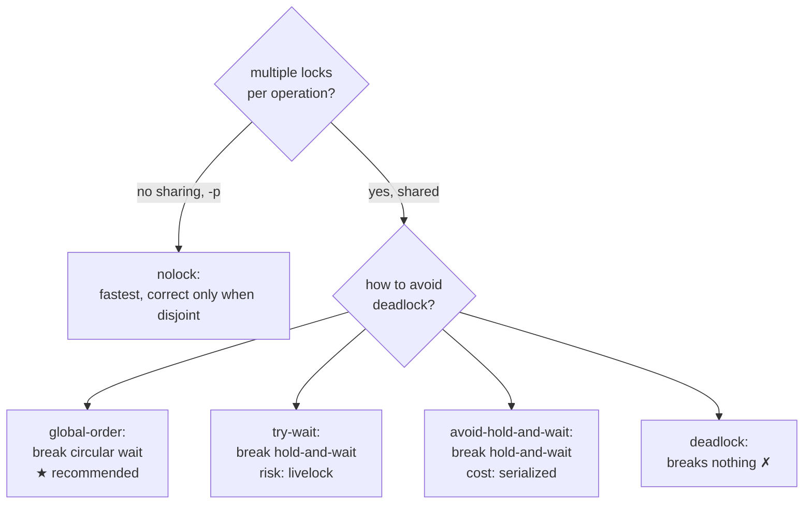

# Concurrency Strategies

All five programs compute the same thing — repeated element-wise
`dst += src` on shared vectors — and differ only in how `vector_add()`
acquires locks. This document explains, for each one: the problem, why it
happens, which **Coffman condition** it removes, why that works, the
trade-offs, alternatives, and the interview questions it invites.

## Background: the four Coffman conditions

A deadlock requires **all four** of these to hold simultaneously. Break any one
and deadlock becomes impossible.

| # | Condition | Meaning |
|---|---|---|
| 1 | **Mutual exclusion** | a lock is held by at most one thread |
| 2 | **Hold-and-wait** | a thread holds locks while waiting for more |
| 3 | **No preemption** | a lock is released only voluntarily |
| 4 | **Circular wait** | a cycle exists in the "waits-for" graph |

Each strategy below targets a specific one of these.

---

## 1. `vector-deadlock` — the bug (removes nothing)

```c
mutex_lock(&dst->lock);
mutex_lock(&src->lock);   // circular wait forms here
dst += src;
mutex_unlock(&src->lock);
mutex_unlock(&dst->lock);
```

**Problem.** Locks are always taken in *parameter* order (dst then src). Under
`-d` the driver has even workers call `vector_add(v0, v1)` and odd workers call
`vector_add(v1, v0)`, so the two groups request the same two locks in opposite
orders.

**Why it deadlocks.** If the scheduler interleaves them so both threads take
their *first* lock before either takes its *second*, all four Coffman
conditions hold and neither can proceed:



**It is nondeterministic.** With `-l 1` the window between the two locks is
tiny and the run usually completes; with large `-l` a hang is nearly certain.
Reproduced in the test suite (`make test`, step 6) with a bounded timeout so
CI never actually hangs.

**Why it is left unfixed:** it is the baseline. Each strategy below removes one
Coffman condition from *this* code.

---

## 2. `vector-global-order` — total lock ordering (removes **circular wait**)

```c
if (dst->id == src->id) { lock once; add; unlock; return; }   // aliased
vector_t *first  = dst->id < src->id ? dst : src;
vector_t *second = dst->id < src->id ? src : dst;
mutex_lock(&first->lock);
mutex_lock(&second->lock);
dst += src;
mutex_unlock(&second->lock);
mutex_unlock(&first->lock);
```

**Idea.** Impose one global order on all locks (ascending vector `id`) and make
every thread obey it regardless of which vector is the destination. If everyone
acquires low-id before high-id, no cycle can form.



The waits-for graph is now acyclic by construction → **no deadlock is
possible** (not just unlikely).

**The aliased special case (homework Q4).** A POSIX mutex is not recursive:
locking it twice from one thread self-deadlocks. When `dst` and `src` are the
same vector we must lock **once** and let the arithmetic double the elements in
place. Even though this driver never aliases the pair, the guard is correct
defensive design and answers the homework's "why the special case?".

**Trade-offs.** Essentially free — it is the recommended real-world default.
The only cost is discipline: *every* site that takes multiple locks must know
and honour the order, which does not scale to large code bases without
convention or tooling.

---

## 3. `vector-try-wait` — trylock + backoff (removes **hold-and-wait**)

```c
for (;;) {
    mutex_lock(&dst->lock);           // first lock: plain, cannot deadlock
    if (mutex_trylock(&src->lock) == 0) { add; unlock both; return; }
    mutex_unlock(&dst->lock);         // give up dst rather than wait holding it
    retries++;
    backoff();                        // sched_yield + small random sleep
}
```

**Idea.** Never *block* while holding a lock. Take `dst`, then *try* for `src`.
If the try fails, release `dst` and start over. A thread therefore never sits
waiting on one lock while holding another — hold-and-wait is gone.



**Is the first `trylock` needed? (homework Q7 — answer: no.)** The
deadlock-breaking property comes entirely from the *second* acquisition being
non-blocking. Blocking on the *first* lock is safe because the thread holds
nothing to wait on. So the first acquisition here is a plain `mutex_lock`.

**Trade-offs — livelock and wasted work.** Two threads can grab their first
lock, fail the second, back off, and repeat in lockstep forever. The randomized
backoff breaks that symmetry probabilistically. The retry counter makes the
overhead measurable, and it grows sharply with contention (real numbers from
this host, `-d`, `l=50000`):

| threads | retries |
|---|---|
| 2 | 215 |
| 4 | 1,027 |
| 8 | 4,581 |
| 16 | 25,349 |

With no `-d` (all threads use the same lock order) the retry count is **0** —
there is never a conflicting second acquisition. See
`docs/assignment-answers.md` Q7.

---

## 4. `vector-avoid-hold-and-wait` — global acquisition lock (removes **hold-and-wait**)

```c
mutex_lock(&g_acquire);        // only one thread may be acquiring at a time
mutex_lock(&dst->lock);
if (dst->id != src->id) mutex_lock(&src->lock);
mutex_unlock(&g_acquire);      // both held: release the gate, keep the locks
dst += src;
... unlock src, dst ...
```

**Idea.** Make acquisition of the *whole* lock set atomic: a thread must hold a
single global "acquisition" mutex to grab any vector lock. Because it takes both
vector locks before releasing the gate, no other thread can be midway through
acquisition — so no thread ever holds one vector lock while waiting for another.

**Main problem (homework Q8).** The global lock **serializes the acquisition
phase of the entire program**. Even workers on completely disjoint vectors (the
`-p` case) must queue on this one mutex, throwing away the parallelism they
could have had. The benchmarks show this starkly (mean seconds, `l=100000`):

| mode | n=1 | n=2 | n=4 | n=8 |
|---|---|---|---|---|
| avoid-hold-and-wait, parallel | 0.0050 | 0.0146 | 0.0547 | 0.1298 |
| global-order, parallel | 0.0053 | 0.0097 | 0.0177 | 0.0230 |

At 8 parallel threads it is ~5.6× slower than global ordering despite doing
identical arithmetic — the cost of the serialization. Releasing the gate as
soon as both locks are held (rather than across the arithmetic) limits the
damage to the acquisition phase but cannot eliminate it.

---

## 5. `vector-nolock` — no locks (removes **mutual exclusion**, breaks correctness)

```c
dst += src;   // no locks at all
```

**Idea.** Remove mutual exclusion entirely. It cannot deadlock — but it is
**not correct**.

**Same semantics? (homework Q9 — answer: no.)** `dst[i] += src[i]` is a
read-modify-write that is not atomic. Two threads can read the same old value,
each add, and both write back — one update is lost. Concurrent read/write of the
same `int` is also a **data race**, i.e. undefined behaviour under the C memory
model. ThreadSanitizer reports it (real output in `docs/testing-strategy.md`),
and the correctness check fails under contention (`make test`, step 8).

**When it happens to be correct:** fully disjoint work (`-p`). With no sharing
there is no race — TSan reports **0 races** under `-p` — which is why nolock is
by far the fastest in parallel mode (0.0076 s at n=8 vs 0.023 s for
global-order) yet fails outright on shared vectors. Speed without correctness is
not a win; that is the lesson.

---

## Strategy comparison



| strategy | Coffman condition removed | deadlock-free | correct (shared) | scalability |
|---|---|---|---|---|
| deadlock | none | ✗ | ✓ (when it completes) | good |
| global-order | circular wait | ✓ | ✓ | **best of the safe** |
| try-wait | hold-and-wait | ✓ | ✓ | good; wastes work under contention |
| avoid-hold-and-wait | hold-and-wait | ✓ | ✓ | poor (serialized acquisition) |
| nolock | mutual exclusion | ✓ | ✗ (races) | best, but incorrect when shared |

**Bottom line:** global ordering is the right default — deadlock-free by
construction, correct, and the fastest of the correct options.

## Likely interview questions

1. Name the four Coffman conditions and say which each strategy removes.
2. Why is deadlock *nondeterministic*? What makes `-l 1` usually fine?
3. In global ordering, why must the order be **global**, not per-thread?
4. Why the aliased-vector special case? What breaks without it?
5. In try-wait, why must you release the first lock before retrying? What is
   livelock and how does backoff mitigate it?
6. Does the first `trylock` need to be a `trylock`? (No — explain.)
7. Why does the global acquisition lock hurt even disjoint (`-p`) work?
8. Prove nolock is racy: give the exact interleaving that loses an update.
9. Why is nolock correct under `-p` but not without it?
10. If you owned this code base, which strategy would you standardize on and
    how would you *enforce* the lock order across a large team?
